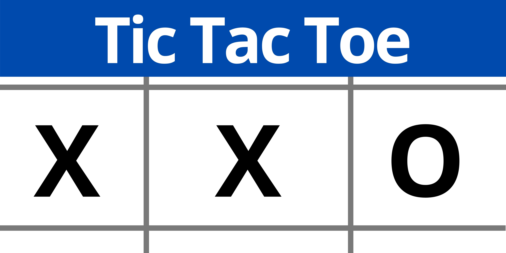
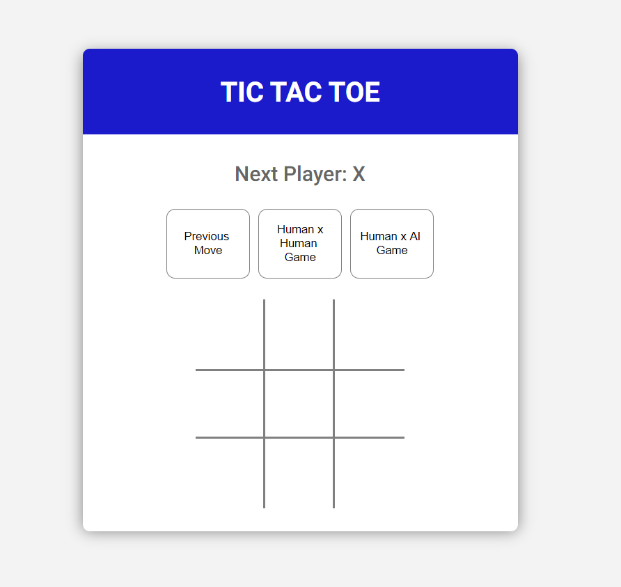

<p align="center">
  
</p>

<p align="center">
  
</p>

<h1 align="center">
 <a href="#screenshot">Screenshot</a> •
 <a href="#requisites">Requisites</a> • 
 <a href="#running">Running The App</a> • 
 <a href="#technologies">Technologies</a> • 
 <a href="#author">Author</a> • 
 <a href="#licence">License</a>

</h1>

<h4 align="center"> 
	Project deployed through Netlify on: <a href="https://unruffled-jang-a400e7.netlify.app/" target="_blank">Tic Tac Toe</a>  
</h4>

<h1 id="screenshot">
	Screenshot
</h1>

<h1 align="center" >
  
  
</h1>

<h1 id="requisites">
	Requisites
</h1>

<p>
Before you begin, you will need to have the following tools installed on your machine:
<a href="https://git-scm.com" target="_blank">Git</a>, <a href="https://nodejs.org/en/" target="_blank">Node.js</a> <br>
In addition, it is good to have an editor to work with the code as <a href="https://code.visualstudio.com/" target="_blank">VScode</a>
</p>

<h1 id="running">
	Running the App
</h1>

```bash
# Clone this Repo
$ git clone https://github.com/JulioLeonardo/javascript-react-github-org-finder

# Access the folder of this project through terminal/cmd
$ cd javascript-react-titactoe

# Open the folder on VScode
$ code .

# Open the terminal with ctrl + ' and install all dependencies
$ yarn

# Run the App in Development mode
$ yarn start

# The App will start at http://localhost:3000
```

<h1 id="technologies">
	Technologies
</h1>

As seguintes ferramentas foram usadas na construção do projeto:

- [JavaScript](https://www.ecma-international.org/publications/standards/Ecma-006.htm)
- [React](https://pt-br.reactjs.org/)
- [Prettier](https://prettier.io/)

<h1 id="author">
	Author
</h1>

<a href="https://github.com/JulioLeonardo">
 
 <br />
 <sub><b>Julio Leonardo</b></sub></a> <a href="https://github.com/JulioLeonardo" title="Julio">🚀</a>


Made with ❤️ by Julio Leonardo 👋🏽 Get in touch!

[](https://www.linkedin.com/in/JulioLeonardoCarvalho/) 
[](mailto:juleolica@gmail.com)

<h1 id="license">
	License
</h1>


